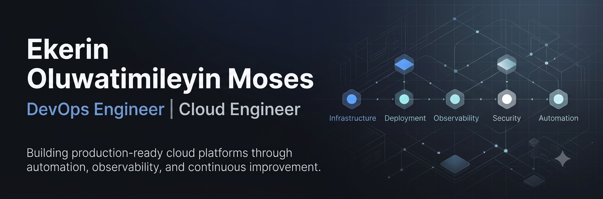
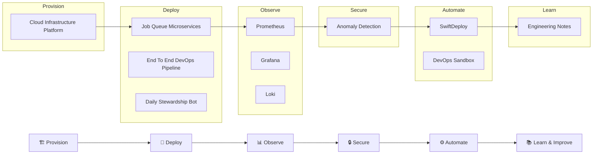

  

---

# 👋 Hi, I'm Ekerin Oluwatimileyin Moses

🚀 **DevOps Engineer | Cloud Engineer | AWS Certified Solutions Architect – Associate**

I build production-ready cloud platforms that make deploying, operating, and securing applications reliable and repeatable.

My work spans Infrastructure as Code, CI/CD automation, containerization, observability, and cloud security—transforming manual operations into automated engineering systems.

---

# ⭐ Flagship Projects

Together, these two projects demonstrate a complete production workflow—from provisioning cloud infrastructure to deploying and operating applications on top of it.

---

## 🏗️ [Cloud Infrastructure Platform](https://github.com/mosesekerin/hng-infrastructure)

Designed and automated a production-ready AWS environment using Terraform and GitHub Actions.

This project provisions and manages cloud infrastructure as code while enabling automated infrastructure updates, secure authentication, monitoring, centralized logging, HTTPS, and operational visibility.

### Highlights

- ☁️ AWS Infrastructure as Code with Terraform
- 🔄 GitHub Actions Infrastructure Pipeline
- 🔐 GitHub OIDC Authentication
- 🌐 HTTPS with Nginx & Route53
- 📊 Prometheus Monitoring
- 📈 Grafana Dashboards
- 📝 Loki Centralized Logging
- 🗄️ Remote Terraform State

**Tech:** AWS • Terraform • GitHub Actions • Prometheus • Grafana • Loki • Nginx

---

## 🚀 [Application Delivery Platform](https://github.com/mosesekerin/job-queue-microservices)

Built and deployed a production-style microservices application onto the infrastructure platform above.

The project demonstrates how applications move from source code to production through automated testing, containerization, security scanning, deployment, monitoring, and operational troubleshooting.

### Highlights

- 🐳 Multi-container Docker Architecture
- 🚀 Six-stage GitHub Actions CI/CD
- 📦 Rolling Deployments
- 🔐 Trivy Security Scanning
- 📊 Production Monitoring
- 🔍 Real Production Incident Debugging

**Tech:** Docker • FastAPI • Redis • GitHub Actions • Linux

---

# 🏗 How I Build Production Systems

Rather than treating my repositories as isolated projects, I build them as different stages of a production engineering workflow.

Starting with cloud infrastructure, I automate deployments, operate and observe running systems, strengthen security, and continuously improve the platform through automation and documentation.

---

## 🛠 Tech Stack

| Cloud & Infrastructure | Containers & CI/CD | Monitoring & Security | Languages & Tools |
|-------------------------|--------------------|-----------------------|-------------------|
| AWS • Terraform • Ansible • Cloud-Init | Docker • Docker Compose • GitHub Actions | Prometheus • Grafana • Loki • Trivy • OPA • Nginx | Python • Bash • Git • Linux • FastAPI • Redis |

---

# 📂 Engineering Projects

## 🔒 Security & Reliability

### 🛡️ [Real-Time Anomaly Detection Engine](https://github.com/mosesekerin/Real-time-anomaly-detection-engine)

Python-based security platform that continuously analyzes Nginx traffic, detects suspicious behavior, and automatically blocks malicious IP addresses using statistical anomaly detection.

**Highlights**

- 200+ automated tests
- <1 ms detection latency
- <50 ms automated response

---

### ⚡ [SwiftDeploy CLI](https://github.com/mosesekerin/swiftdeploy)

A deployment automation platform implementing canary deployments, policy-as-code, Prometheus instrumentation, and deployment auditing to improve release confidence and operational visibility.

---

## ⚙️ Platform Engineering

### 🧪 [DevOps Sandbox Platform](https://github.com/mosesekerin/DevOps-Sandbox)

A platform engineering lab for experimenting with ephemeral environments, Docker orchestration, automation, and chaos engineering practices.

---

## 🤖 Automation

### 🤖 [Daily Spiritual Stewardship Tracker](https://github.com/mosesekerin/daily-stewardship-bot)

Production-ready Telegram bot featuring scheduling, persistent storage, Docker deployment, and a scalable multi-user architecture.

---

## 🌍 Product Development

### 🏥 [CuraMap — Best Project, Karatu Cohort 2024](https://codes-tau.vercel.app/)

Co-led the development of a web platform that aggregates registered online pharmacies, helping patients search for medication availability and order from verified providers.

🏆 **Awarded Best Project — Karatu Cohort 2024**

---

# 🏅 Certifications

- 🏅 AWS Certified Solutions Architect – Associate
- ☁️ AWS Certified Cloud Practitioner
- 🎓 Diploma in Cloud Engineering — AltSchool Africa
- 🚀 HNG DevOps Internship
- 🤖 ALX AI Career Essentials

---

## 🌱 Currently Building

- Site Reliability Engineering
- DevSecOps
- Cloud Security

---

# 💡 Engineering Philosophy

The systems I build are guided by a few core principles.

- Design systems for reliability before scale.
- Automate repetitive work wherever possible.
- Prefer Infrastructure as Code over manual configuration.
- Build observable systems that are easy to troubleshoot.
- Treat failures as opportunities to improve the platform.
- Document engineering decisions—not just implementations.

---

## 🌐 Let's Connect

💼 [**LinkedIn**](https://linkedin.com/in/oluwatimileyin-ekerin-7836b7203)

✍ [**Medium**](https://medium.com/@mosesekerin)

📧 [**Email**](mosesekerin@gmail)

📄 [**Resume**](https://drive.google.com/file/d/1xrwTz3PnCaFg8WXz1jNvBh59_n2NwR7D/view?usp=sharing)

---

# 📈 Open Source Activity

---

> *"Build systems that future engineers will thank you for."*
